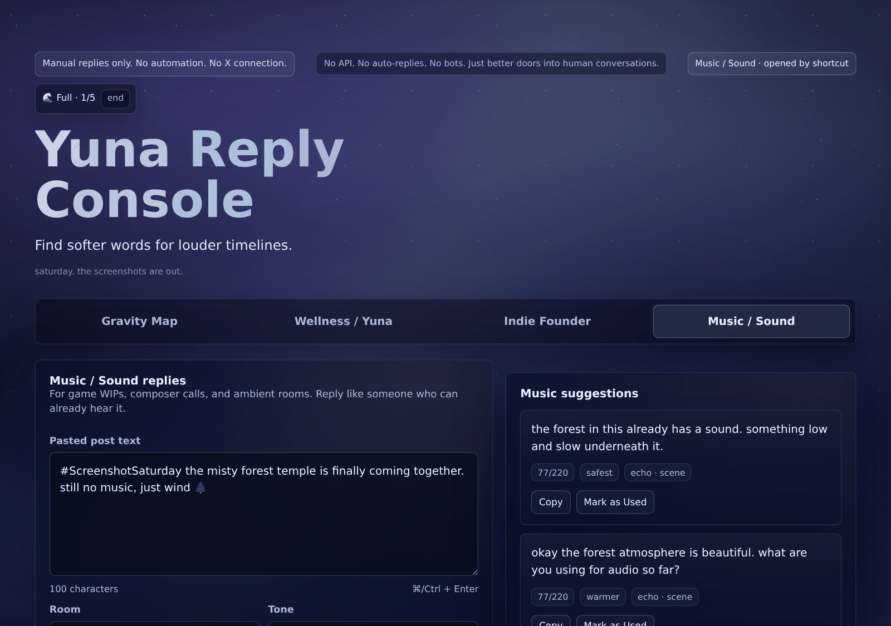

# Yuna Reply Console

**A local-first, human-in-the-loop reply companion for thoughtful conversations on X.**

Not a bot. Not automation. Not an engagement farm.

[](https://github.com/inhaleexhaleapp/yuna-reply-console/actions/workflows/test.yml)
[](LICENSE)


**[Open the live console →](https://inhaleexhaleapp.github.io/yuna-reply-console/)**



Yuna helps you find living conversations, decide whether they deserve your energy, and draft short, human replies you copy and post yourself. It was built for [`@inhaleexhaleapp`](https://x.com/inhaleexhaleapp): calm tech, ambient music, and indie game soundtracks.

It never connects to X. No API, no posting, liking, following, DMs, or scraping. Yuna only opens doors: search links, profile links, scores, drafts, and private notes. You decide where to enter, what to copy, and what to post.

## Why

Online conversation rewards speed, volume, and performance. Yuna is built for a calmer path: notice better rooms, pause before replying, and write something that sounds like a person who actually read the post.

That is also what works on X for small accounts. Templated, repeated or link-heavy replies get filtered, while real replies build mutuals. So Yuna is designed to keep every reply specific and different from the last one.

## Tabs

| Tab | What it's for |
| --- | --- |
| **Gravity Map** | Score a thread or account before replying: niche fit, reply culture, freshness, aesthetic alignment, reciprocity. Save candidates to private radar lists and account notes. |
| **Wellness / Yuna** | Soft replies for calm-internet rooms: sleep, overthinking, meditation, ambient and mantra culture. |
| **Indie Founder** | Low-ego builder replies for "what are you building?", launches, app review pain and late-night shipping. Skips threads that are too noisy to be seen in. |
| **Music / Sound** | Replies for game WIPs (`#ScreenshotSaturday`), composer calls, composer peers and ambient producers, plus a *People to know* list for building real mutuals. |

Every tab includes a **Search Radar** of preset X searches (opened in Latest view) for manual discovery.

## How the reply engine thinks

Everything below runs in your browser from the text you paste. There is no model and no network call.

- **Echo engine.** Pulls one concrete detail from the post (`3am`, `2019`, `10 users`, `6 hours`, `432hz`, `cursor`, `app store rejection`, `misty forest`, `felt piano`…) and writes it back into a few replies, so they reference the post instead of floating above it.
- **Intent.** Reads what the post is doing: question, invitation, share, celebration, struggle, confession. Real questions get a first-person answer instead of sympathy, and invitations get your own answer instead of an echo.
- **No dangling "this".** Replies like "tried this with headphones" are pushed down when the post isn't actually sharing a track, link or app.
- **Similarity guard.** Every reply is compared with your last 30 used replies across all tabs. Near-duplicates are pushed down and flagged, and one template is never used twice in the same set.
- **Composer calls** (Music tab) are detected automatically. At most two soft offers per set, never a hard pitch. A portfolio link is only added if you set one and allow it.
- **Reply Worthiness.** A 0–100 score that weighs visibility (25%), relevance (25%), conversation potential (30%) and warmth fit (20%), with plain-language reasons and a suggested approach.
- **Voice rules.** Short, mostly lowercase, low-ego, slightly imperfect. No hashtags, guru tone, LinkedIn tone, therapy-speak or sales language. Each set is shaped as *safest, warmer, slightly witty, mentor-aware, ultra-short*.
- **Copy Claude prompt.** When a post deserves better than a template, one button copies a ready prompt with the post, detected intent, anchors, worthiness score, link rules and all voice rules. You paste it into claude.ai yourself. The console only writes to your clipboard.

Replies should feel noticed, not written.

## Session intentions

On launch, Yuna asks how you want to exist online tonight:

- **Map only.** Score and map, no replies.
- **Looking.** Browse notes and lists, no replies.
- **Reply soft.** Up to 3 reply generations.
- **Full.** Up to 5 reply generations.

Limits are a mindful pause, not a lock: you can deliberately bypass them. Sessions expire after 6 hours and are archived locally.

## Privacy and your data

- Runs entirely in the browser: no accounts, tracking, backend, API key or cloud storage.
- Everything is kept in `localStorage` on the device you use.
- **Your data** panel: *Save backup file* exports all Yuna data as one JSON file, and *Restore from backup* loads it on another device (for example iPad ⇄ Mac). Restoring shows a summary and asks before replacing anything.
- A test checks that the code never makes network calls.

## Use it

**Live:** https://inhaleexhaleapp.github.io/yuna-reply-console/

**Locally:** download or clone the repo and open `index.html`. No build step, server or `npm install` needed.

**Launch modes** for iOS Shortcuts or bookmarks. They only switch tabs and adjust microcopy:

`?mode=gravity` · `?mode=wellness` · `?mode=founder` · `?mode=music` · `?mode=tonight`

**Keyboard**

- `⌘/Ctrl + Enter` in any post box generates replies.
- In Gravity Map: `⌘/Ctrl + Enter` scores the thread, `⌘/Ctrl + Shift + Enter` drafts secondary replies, `⌘/Ctrl + S` saves the radar session.

## Project structure

```
index.html            markup only
css/yuna.css          styles (night-sky theme)
js/
  data/               reply banks, lexicons, search presets per tab
  core/               utils, storage keys, backup, DOM refs, state
  engine/             pure logic: echo, worthiness, similarity, text rules,
                      per-tab candidate builders, Claude prompt
  ui/                 rendering and actions per tab
  app.js              event wiring and startup (loaded last)
tests/                node:test suites, zero dependencies
```

Scripts are plain classic `<script>` files that share one global scope. There are no modules and no bundler, so the page runs straight from the file system.

## Tests

```bash
node --test
```

The engine files load into a Node `vm` context, so they are tested without a browser or any npm packages. The suites cover intent, anchors, echo replies, similarity, people-list parsing, composer calls, reply-set invariants (length, uniqueness, banned phrases), backup validation, list merging, and page integrity. GitHub Actions runs them on every push.

## Roadmap

- Learn from used replies: rank the reply styles you actually post.
- More localization.
- Accessibility pass.
- Community-contributed reply styles.

## License

[MIT](LICENSE) © Inhale Exhale Studio
